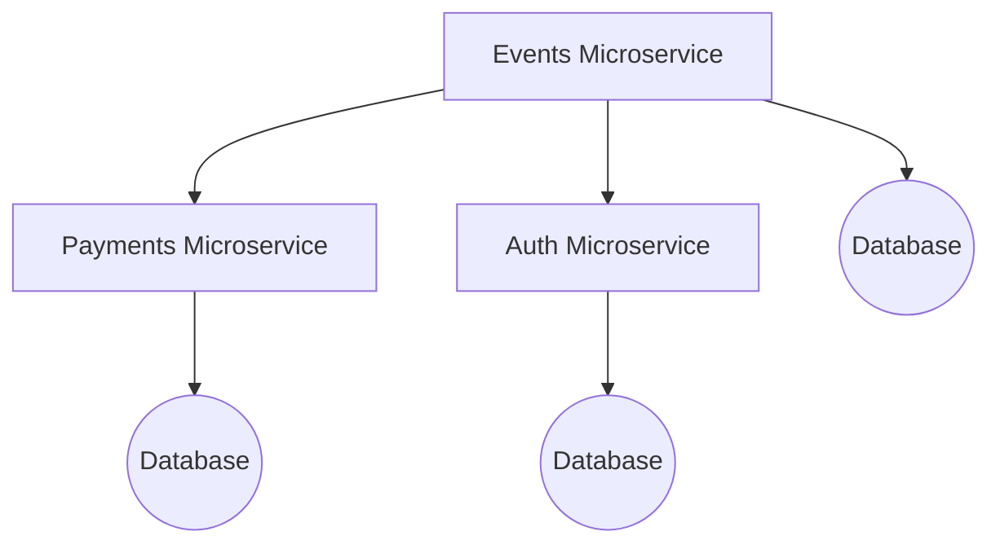
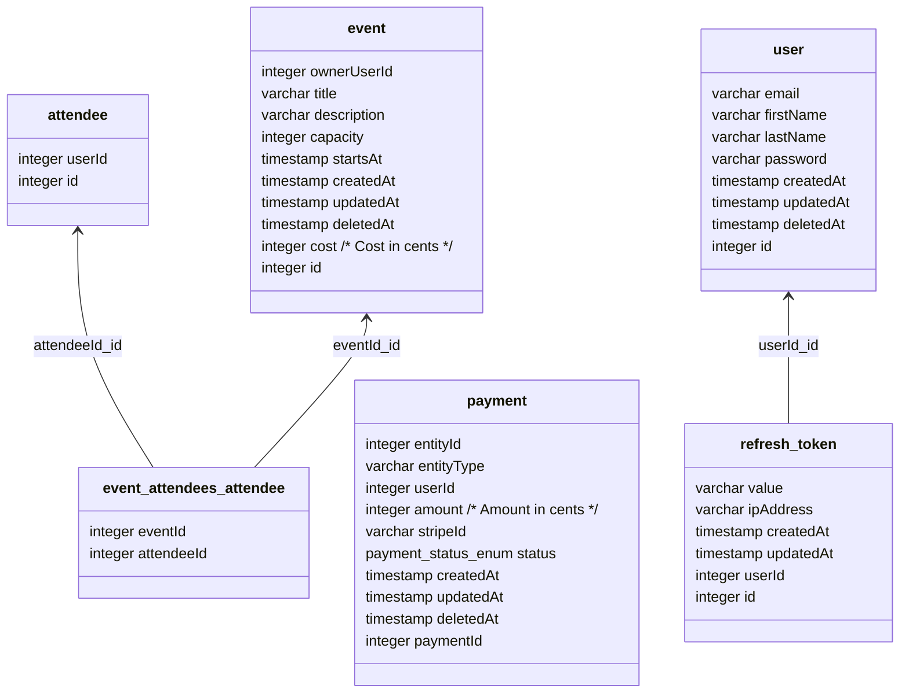

# Nest Microservices Example

- Each microservice is deployable independently
- Each microservice is independently scalable
- Loosely coupled (use _auth_ or _payments_ microservices with your own microservices)



## Setup

1. Install dependencies: `yarn install` (the project uses [yarn](https://github.com/yarnpkg))
2. Run infrastructure `docker-compose up`
3. Run database migrations: `make migration-run`

Set `STRIPE_SECRET_KEY` in `/apps/payments/.env` to your Stripe secret key.

## Development

- `docker-compose up` - run database and all microservices
- `yarn type-check` - run type checking
- `yarn lint:ts` - run linter
- `yarn format` - run prettier
- `yarn test` - run tests

You can also run microservices without docker:

- `yarn auth:dev` - run auth microservice
- `yarn events:dev` - run events microservice
- `yarn payments:dev` - run payments microservice

## Database

Note that for simplicity all microservices use the same database. Update `# database config` section in `.env` files to
use different database.

- `yarn {appName}:migration:generate  apps/{appName}/src/modules/database/migrations/{migrationName}` - create new
  migration file
- `yarn {appName}:migration:run` - run all pending migrations
- `yarn {appName}:migration:revert` - revert last migration
- `yarn {appName}:schema:drop` - drop all tables

Example:

```bash
$ yarn events:migration:generate apps/events/src/modules/database/migrations/initial
$ yarn events:migration:run
```

Database schema:



## Testing

Most of the tests are E2E tests, which means that they are testing the whole application, including the database.

- `yarn test` - run all tests

You can use `bootstrap` from `@shared/common` to reduce boilerplate in services tests:

```ts
//
//
// setup

beforeAll(async () => {
  app = await bootstrap({
    imports: [WrappedConfigModule, WrappedDatabaseModule, YourModule],
  })

  databaseService = app.get(TestingDatabaseService)
})

beforeEach(async () => {
  await databaseService.clearDb()
})

afterAll(async () => {
  await databaseService.dataSource.destroy()
})
```
