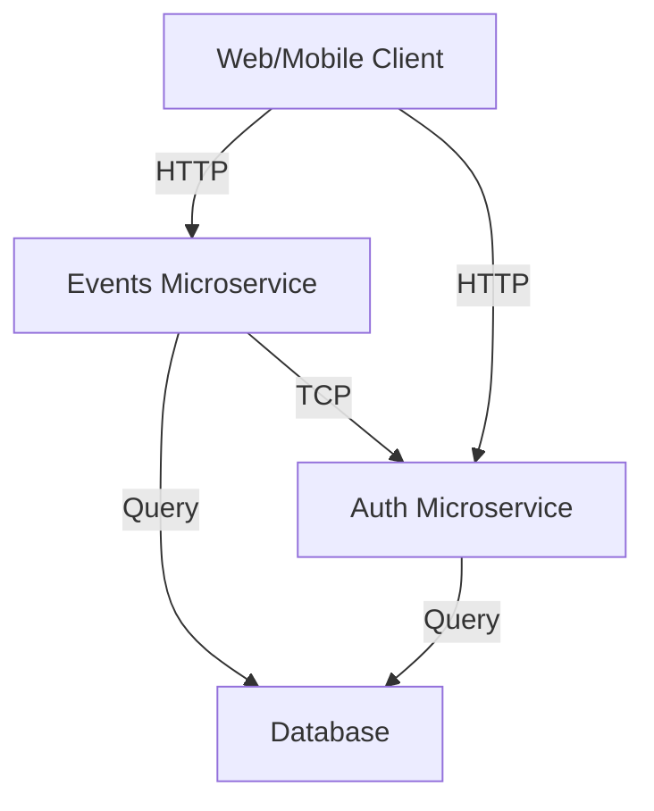
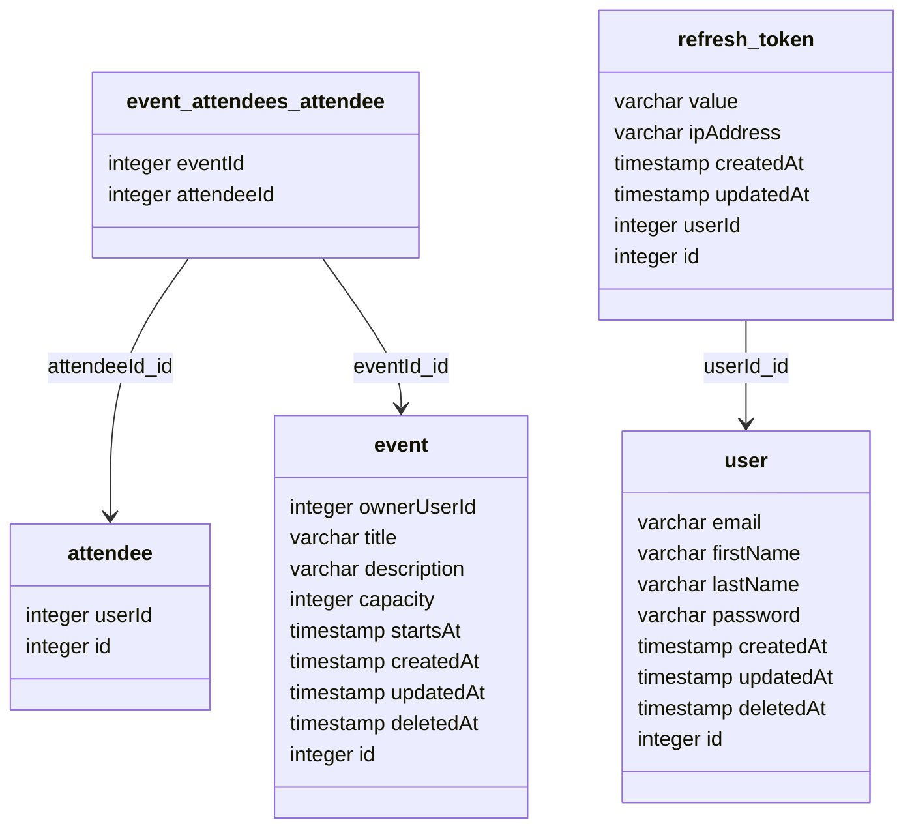

# Nest Microservices Example



## Setup

1. Install dependencies: `yarn install` (the project uses [yarn](https://github.com/yarnpkg))
2. Run infrastructure `docker-compose up`
3. Run database migrations: `make migration-run`

## Development

- `yarn auth:dev` - run auth microservice
- `yarn events:dev` - run events microservice
- `yarn type-check` - run type checking
- `yarn lint:ts` - run linter
- `yarn format` - run prettier
- `yarn test` - run tests

## Database

- `yarn {appName}:migration:generate  apps/{appName}/src/modules/database/migrations/{migrationName}` - create new migration file
- `yarn {appName}:migration:run` - run all pending migrations
- `yarn {appName}:migration:revert` - revert last migration
- `yarn {appName}:schema:drop` - drop all tables

Example:

```bash
$ yarn events:migration:generate apps/events/src/modules/database/migrations/initial
$ yarn events:migration:run
```

Database schema:



## Testing

Most of the tests are E2E tests, which means that they are testing the whole application, including the database.

- `yarn test` - run all tests
